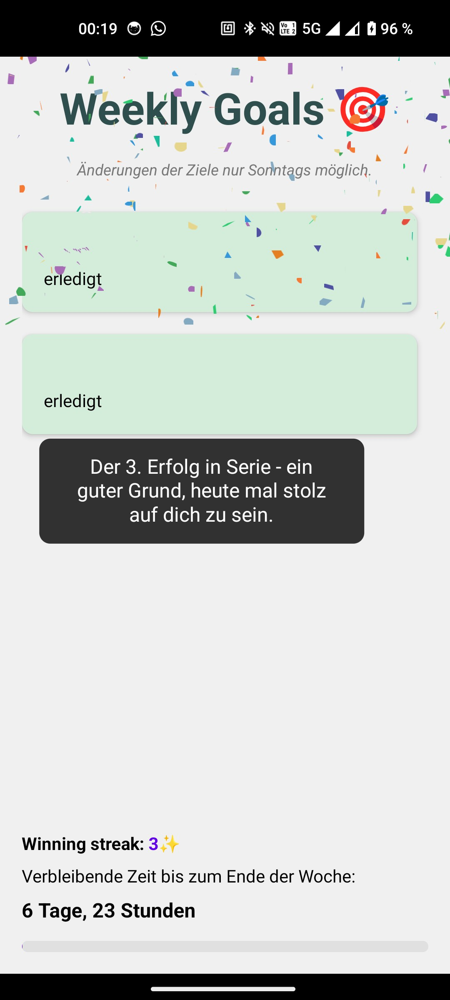

# Weekly Goals App

### This is a React native App for tracking your weekly goals and to keep you motivated.

## Features:

- add and delete goals (Can only be changed on sundays for more commitment)
- timeline with progressbar
- winningStreak with different levels
- 13 different congrats messages when goals completed in different levels

## Build and Install the Application

You can install the app with:

```bash
# using npm
cd android
./gradlew assembleRelease
adb install android/app/build/outputs/apk/release/app-release.apk

```

## Start your Application for testing purposes

Node and Android Studio have to be installed. Open a _new_ terminal from the _root_ of your React Native project. Run the following command to start your _Android_ app:

```bash
# using npm
npm i
npx react-native run-android
```

## Preview



## Learn More

To learn more about React Native, take a look at the following resources:

- [React Native Website](https://reactnative.dev) - learn more about React Native.
- [Getting Started](https://reactnative.dev/docs/environment-setup) - an **overview** of React Native and how setup your environment.
- [Learn the Basics](https://reactnative.dev/docs/getting-started) - a **guided tour** of the React Native **basics**.
- [Blog](https://reactnative.dev/blog) - read the latest official React Native **Blog** posts.
- [`@facebook/react-native`](https://github.com/facebook/react-native) - the Open Source; GitHub **repository** for React Native.
